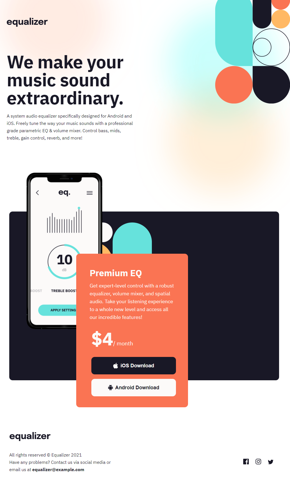

# Frontend Mentor - Equalizer landing page solution

This is a solution to the [Equalizer landing page challenge on Frontend Mentor](https://www.frontendmentor.io/challenges/equalizer-landing-page-7VJ4gp3DE). Frontend Mentor challenges help you improve your coding skills by building realistic projects.

## Table of contents

- [Overview](#overview)
  - [The challenge](#the-challenge)
  - [Screenshot](#screenshot)
  - [Links](#links)
- [My process](#my-process)
  - [Built with](#built-with)
  - [What I learned](#what-i-learned)
- [Author](#author)

## Overview

### The challenge

Users should be able to:

- View the optimal layout depending on their device's screen size
- See hover states for interactive elements

### Screenshot

### Links

- Solution URL: [Source](https://github.com/steveWhoCodes/Equalizer-landing-page)
- Live Site URL: [Demo](https://stevewhocodes.github.io/Equalizer-landing-page/)

## My process

### Built with

- Semantic HTML5 markup
- CSS custom properties
- Flexbox
- Mobile-first workflow

### What I learned

- Learned a lot about building from mobile view to tablet view and then to desktop view. Especially the decisions you make with how you build the semantic HTML can really haunt you in different media queries if not thought out.

- Learned about CSS filter for changing svg backgrounds. That was AWESOME!

## Author

- Website - [Steven Palfreyman](https://www.stevewhocodes.com)
- Frontend Mentor - [steveWhoCodes](https://www.frontendmentor.io/profile/steveWhoCodes)
- Twitter - [stevewhocodes](https://www.twitter.com/stevewhocodes)
